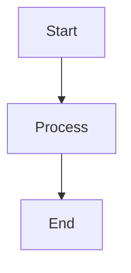

# mark-deco-cli

Command-line interface for [mark-deco](https://npmjs.com/package/mark-deco) enhanced markdown processor with plugin support for oEmbed, Amazon cards, and more.

## Installation

```bash
# Install globally
npm install -g mark-deco-cli

# Or run directly with npx
npx mark-deco-cli input.md
```

## Usage

### Basic Usage

```bash
# Process from stdin to stdout
echo "# Hello World" | mark-deco-cli

# Process a file
mark-deco-cli -i input.md

# Save output to file
mark-deco-cli -i input.md -o output.html
```

### Command Line Options

```
Options:
  -i, --input <file>              Input markdown file (default: stdin)
  -o, --output <file>             Output HTML file (default: stdout)
  -c, --config <file>             Configuration file path
  -p, --plugins <plugins...>      Enable specific plugins (oembed, card, mermaid)
      --no-plugins                Disable all default plugins
      --unique-id-prefix <prefix>  Prefix for unique IDs (default: "section")
      --hierarchical-heading-id    Use hierarchical heading IDs (default: true)
      --content-based-heading-id   Use content-based heading IDs (default: false)
  -h, --help                      Display help for command
  -V, --version                   Display version number
```

### Examples

```bash
# Basic markdown processing
echo "# Hello World" | mark-deco-cli

# Process file with custom ID prefix
mark-deco-cli -i document.md --unique-id-prefix "doc"

# Disable all plugins
mark-deco-cli -i simple.md --no-plugins

# Enable specific plugins only
mark-deco-cli -i content.md -p oembed mermaid

# Use configuration file
mark-deco-cli -i content.md -c config.json
```

## Configuration File

You can use a JSON configuration file to set default options:

```json
{
  "plugins": ["oembed", "card", "mermaid"],
  "uniqueIdPrefix": "section",
  "hierarchicalHeadingId": true,
  "contentBasedHeadingId": false,
  "oembed": {
    "enabled": true,
    "timeout": 5000
  },
  "card": {
    "enabled": true,
    "amazonAssociateId": "your-associate-id"
  },
  "mermaid": {
    "enabled": true,
    "theme": "default"
  }
}
```

## Supported Features

- **Frontmatter**: YAML frontmatter extraction and processing
- **GitHub Flavored Markdown**: Tables, task lists, strikethrough, and more
- **oEmbed**: Automatic embedding of YouTube, Twitter, and other oEmbed providers
- **Amazon Cards**: Rich cards for Amazon product links
- **Mermaid Diagrams**: Flowcharts, sequence diagrams, and more
- **Hierarchical Heading IDs**: Automatic generation of structured heading IDs
- **Responsive Images**: Automatic responsive image handling

## Plugin Support

### oEmbed Plugin
Automatically converts URLs from supported providers into rich embeds:
- YouTube videos
- Twitter posts  
- Instagram posts
- And many more oEmbed providers

### Card Plugin
Creates rich cards for supported URLs:
- Amazon product links
- General webpage cards

### Mermaid Plugin
Renders Mermaid diagrams from code blocks:
```markdown

```

## Development

This CLI is part of the mark-deco monorepo. To contribute:

1. Clone the repository
2. Install dependencies: `npm install`
3. Build the project: `npm run build`
4. Run tests: `npm test`

## License

MIT License - see LICENSE file for details. 