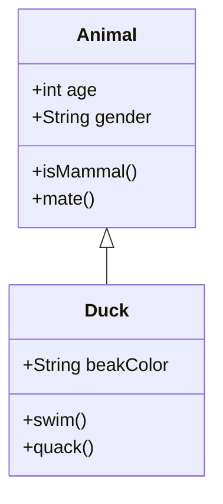
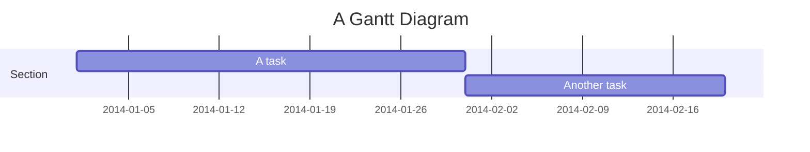
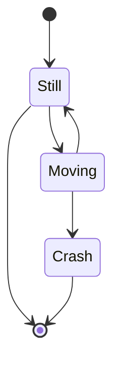

# Complex Mermaid Test

This test verifies that complex mermaid diagram types are correctly processed.

## Class Diagram

```mermaid
classDiagram
    class Animal{
      +int age
      +String gender
      +isMammal()
      +mate()
    }
    class Duck{
      +String beakColor
      +swim()
      +quack()
    }
    Animal <|-- Duck
```

## Gantt Chart

```mermaid
gantt
    title A Gantt Diagram
    dateFormat  YYYY-MM-DD
    section Section
    A task           :a1, 2014-01-01, 30d
    Another task     :after a1  , 20d
```

## State Diagram

```mermaid
stateDiagram-v2
    [*] --> Still
    Still --> [*]
    Still --> Moving
    Moving --> Still
    Moving --> Crash
    Crash --> [*]
``` 