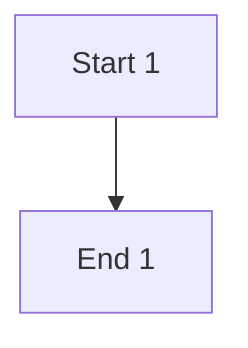
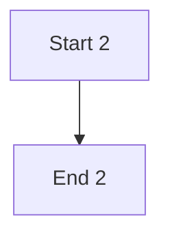

# Multiple Mermaid Test

This test verifies that multiple mermaid diagrams on the same page are correctly processed.

## First Diagram

```mermaid
graph TD
    A1[Start 1] --> B1[End 1]
```

## Second Diagram

```mermaid
graph TD
    A2[Start 2] --> B2[End 2]
```

## Third Diagram

```mermaid
graph TD
    A3[Start 3] --> B3[End 3]
```

## Custom ID Diagram

```mermaid
graph LR
    A[Test] --> B[Diagram]
``` 