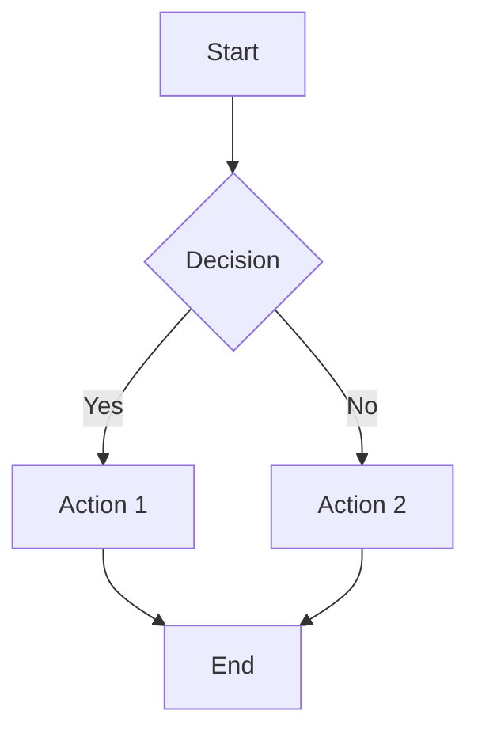
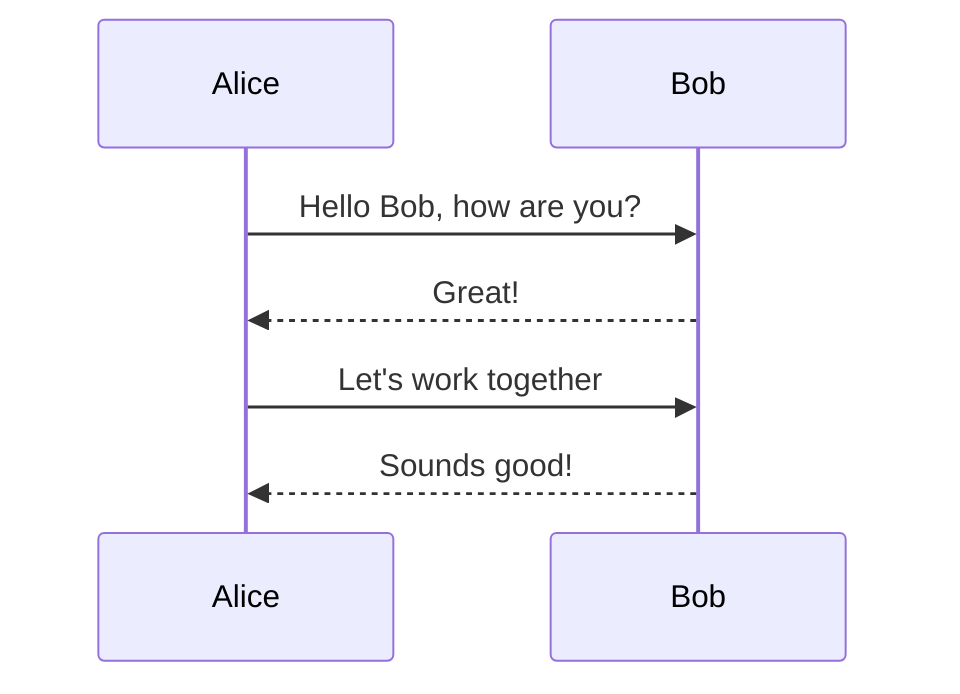
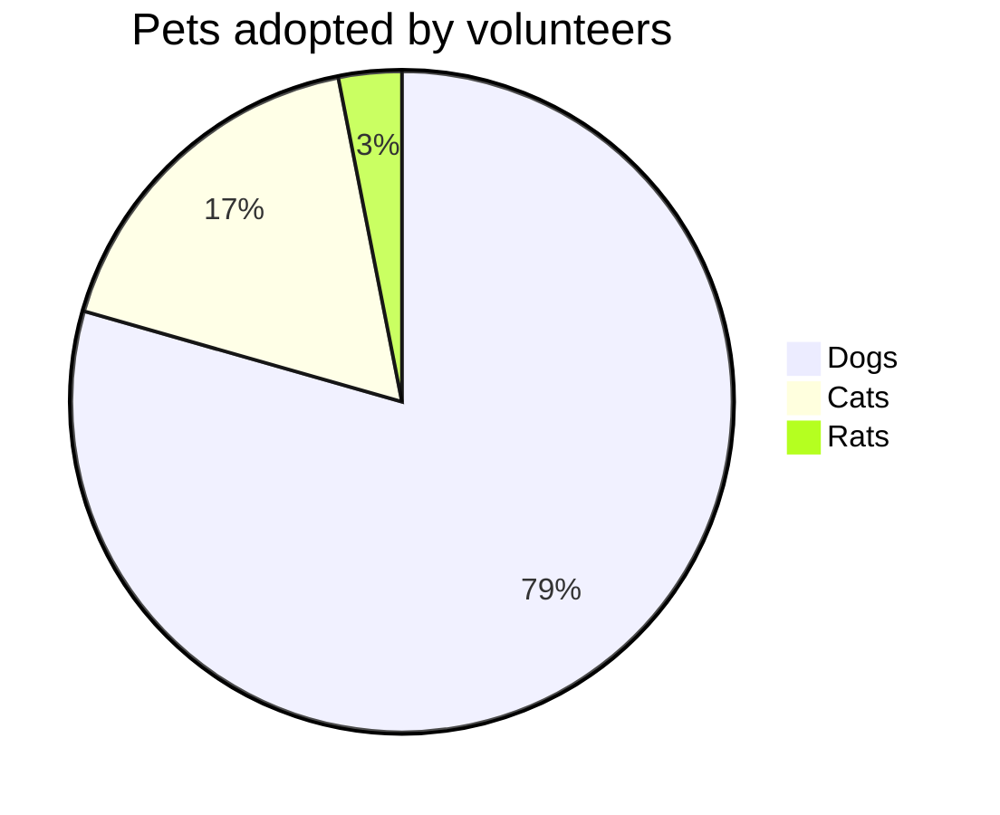
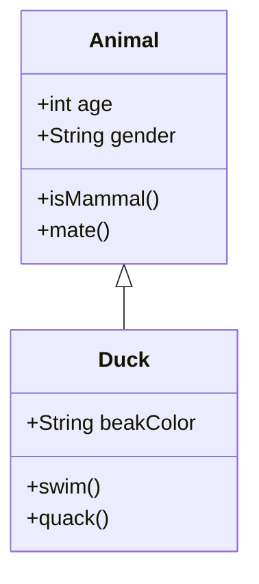

# Mermaid Plugin Test

This test verifies that the mermaid plugin processes diagrams correctly.

## Simple Flowchart

## Sequence Diagram

## Pie Chart

## Class Diagram

This should create proper HTML elements that mermaid.js can render as SVG diagrams. 